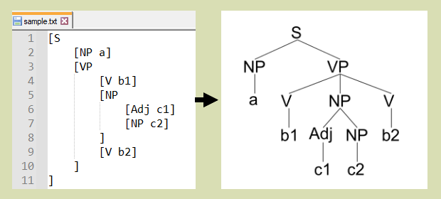

# cpp-syntax-tree

cpp-syntax-tree is a graphical syntax tree generator written in the C++ language.  

Example1.  
  
Example2.  
  

## Usage.
You can find input file examples at this project/test/data directory.  
```
cpp-syntax-tree [options] <file>

Draw syntax tree from the input file.

Options:
    -t, --type   <type>   specify output file type(pdf/svg/png/dot).
    -o, --output <file>   specify output file name.
        --hns    <n>      specify horizontal node separation.
        --vns    <n>      specify vertical node separation.
        --pmw    <n>      specify page margin width.
        --pmh    <n>      specify page margin height.
        --fts    <n>      specify font size.
    -h, --help            show help.
    -v, --version         show version.
```
## The input syntax tree grammar.
```C++
Tree -> "[" label Tree... "]"
```
- The label is a string except control/space/square-bracket chars.  
- The label can be a C++ raw string.  

The C++ raw string is used to wrap tree node properties and it is used like this:
```
[AppleTree
    [R"(label = "apple" color = "red")"]
]
```
It is like node property of dot of graphviz(https://www.graphviz.org/), so that it can export dot file that can be rendered by dot. At the moment, this tool only support label and color property, and other properties(may be supported by dot) will be ignored here. If you need more customized syntax tree, you could export dot file rendered by dot. The color is x11-color-name which is defined here: https://gitlab.freedesktop.org/xorg/app/rgb/raw/master/rgb.txt  

## How to build it.
For the Unix* system:  
1, Install git, cmake and a C++11 compiler.  
2, Install cairo library(https://www.cairographics.org/), version >= 1.16  
3, Git clone this project and run follow commands.
```
cmake -S . -B build
cmake --build build
```
For the Windows system:  
1, Install vcpkg(https://github.com/microsoft/vcpkg).  
2, Git clone this project and run follow commands.  
```
vcpkg install cairo

cmake -S . -B build-msvc -G "Visual Studio 16 2019" -A Win32 
      -DCMAKE_INSTALL_PREFIX=./installed-msvc
      -DVCPKG_TARGET_TRIPLET=x86-windows
      -DCMAKE_TOOLCHAIN_FILE=<path-to>/vcpkg/scripts/buildsystems/vcpkg.cmake

cmake --build build-msvc
```

# References  
Papers:  
"\[1981]\[RT] Reingold and Tilford - Tidier Drawings of Trees".   
"\[1990]\[W] John.Q Walker II - A Node Positioning Algorithm for General Trees".  
"\[2002]\[BJL] Christoph Buchheim, Michael Jünger, and Sebastian Leipert -  
Improving Walker's Algorithm to Run in Linear Time".  

https://ctan.org/pkg/qtree  
https://github.com/yohasebe/rsyntaxtree  
http://ironcreek.net/syntaxtree/  
https://www.cairographics.org/  
https://www.graphviz.org/documentation/  
https://gitlab.freedesktop.org/xorg/app/rgb/raw/master/rgb.txt  
